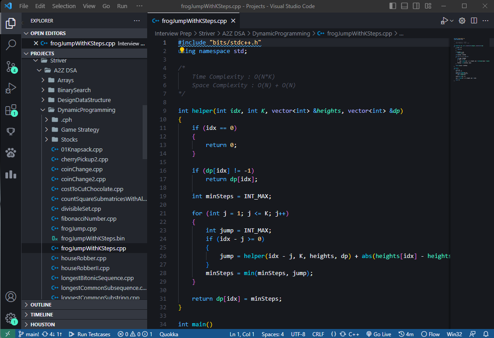

<!-- Improved compatibility of back to top link: See: https://github.com/othneildrew/Best-README-Template/pull/73 -->
<a name="readme-top"></a>
<!--
*** Thanks for checking out the Best-README-Template. If you have a suggestion
*** that would make this better, please fork the repo and create a pull request
*** or simply open an issue with the tag "enhancement".
*** Don't forget to give the project a star!
*** Thanks again! Now go create something AMAZING! :D
-->


<!-- PROJECT SHIELDS -->
<!--
*** I'm using markdown "reference style" links for readability.
*** Reference links are enclosed in brackets [ ] instead of parentheses ( ).
*** See the bottom of this document for the declaration of the reference variables
*** for contributors-url, forks-url, etc. This is an optional, concise syntax you may use.
*** https://www.markdownguide.org/basic-syntax/#reference-style-links
-->
[![Contributors][contributors-shield]][contributors-url]
[![Forks][forks-shield]][forks-url]
[![Stargazers][stars-shield]][stars-url]
[![Issues][issues-shield]][issues-url]
[![MIT License][license-shield]][license-url]
[![LinkedIn][linkedin-shield]][linkedin-url]


<!-- PROJECT LOGO -->
<br />
<div align="center">
  <a href="https://github.com/knowgaurav/interview-prep">
    
  </a>

<h3 align="center">Top DSA Interview Questions</h3>

  <p align="center">
A comprehensive collection of top Data Structures and Algorithms (DSA) interview questions to help you ace technical interviews. Find categorized questions & clear solutions in C++ Language. Get ready to succeed with this valuable resource and secure your dream tech job. Start preparing today!
    <br />
    <a href="https://github.com/knowgaurav/interview-prep">View Demo</a>
    ·
    <a href="https://github.com/knowgaurav/interview-prep/issues">Report Bug</a>
    ·
    <a href="https://github.com/knowgaurav/interview-prep/issues">Request Feature</a>
  </p>
</div>


<!-- TABLE OF CONTENTS -->
<details>
  <summary>Table of Contents</summary>
  <ol>
    <li>
      <a href="#about-the-project">About The Project</a>
      <ul>
        <li><a href="#built-with">Built With</a></li>
      </ul>
    </li>
    <li>
      <a href="#getting-started">Getting Started</a>
      <ul>
        <li><a href="#prerequisites">Prerequisites</a></li>
        <li><a href="#installation">Installation</a></li>
      </ul>
    </li>
    <li><a href="#contributing">Contributing</a></li>
    <li><a href="#license">License</a></li>
    <li><a href="#contact">Contact</a></li>
    <li><a href="#acknowledgments">Acknowledgments</a></li>
  </ol>
</details>


<!-- ABOUT THE PROJECT -->
## About The Project

  <a href="https://github.com/knowgaurav/interview-prep">
    
  </a>


<p align="right">(<a href="#readme-top">back to top</a>)</p>


### Built With

* [![Cpp][C++]][C++-url]
* [![LeetCode][LeetCode]][Leetcode-url]
* [![Codeforces][Codeforces]][Codeforces-url]

<p align="right">(<a href="#readme-top">back to top</a>)</p>


<!-- GETTING STARTED -->
## Getting Started

This is an example of how you may give instructions on setting up your project locally.
To get a local copy up and running follow these simple example steps.

### Prerequisites

This is an example of how to list things you need to use the software and how to install them.
* npm
  ```sh
  npm install npm@latest -g
  ```

### Installation

**Usage Guide: Running C++ Files**

Welcome to the repository containing various C++ files. This guide will walk you through the steps to run these C++ programs on your local machine.

**Prerequisites:**
1. Ensure you have a C++ compiler installed on your system. We recommend using `g++` for Unix-based systems and `MinGW` for Windows users.
2. Have a code editor or IDE installed, such as Visual Studio Code, Sublime Text, or Code::Blocks.

**Instructions:**
1. Clone or download this repository to your local machine using the "Clone" or "Download" button on GitHub.
2. Navigate to the root directory of the downloaded repository using the terminal (for Unix-based systems) or command prompt (for Windows).
3. Locate the C++ file you want to run within the repository's directory structure.

**Running the C++ Program:**
4. Open your terminal or command prompt and navigate to the directory where the C++ file is located.
5. Use the following command to compile the C++ file and generate an executable:

For Unix-based systems (using g++):
```
g++ -o output_filename input_filename.cpp
```

For Windows (using MinGW):
```
g++ -o output_filename.exe input_filename.cpp
```

Replace `output_filename` with the desired name for the executable and `input_filename.cpp` with the name of the C++ file you want to run.

**Executing the Program:**
6. After a successful compilation, run the executable by typing the following command:

For Unix-based systems:
```
./output_filename
```

For Windows:
```
output_filename.exe
```

The C++ program will now execute, and you'll see the output in the terminal or command prompt.

**Important Note:**
- Some C++ files may have specific input requirements. Ensure you provide the necessary inputs as prompted while running the program.

Now you're all set to explore and run the C++ files in this repository. Happy coding!

<p align="right">(<a href="#readme-top">back to top</a>)</p>


<!-- CONTRIBUTING -->
## Contributing

Contributions are what make the open source community such an amazing place to learn, inspire, and create. Any contributions you make are **greatly appreciated**.

If you have a suggestion that would make this better, please fork the repo and create a pull request. You can also simply open an issue with the tag "enhancement".
Don't forget to give the project a star! Thanks again!

1. Fork the Project
2. Create your Feature Branch (`git checkout -b feature/importantquestion`)
3. Commit your Changes (`git commit -m 'Add some importantquestion'`)
4. Push to the Branch (`git push origin feature/importantquestion`)
5. Open a Pull Request

<p align="right">(<a href="#readme-top">back to top</a>)</p>


<!-- LICENSE -->
## License

Distributed under the MIT License. See `LICENSE.txt` for more information.

<p align="right">(<a href="#readme-top">back to top</a>)</p>


<!-- CONTACT -->
## Contact

Gaurav Singh - [@knowgaurav01](https://twitter.com/knowgaurav01) - hello@sgaurav.me

Project Link: [https://github.com/knowgaurav/interview-prep](https://github.com/github_username/interview-prep)

<p align="right">(<a href="#readme-top">back to top</a>)</p>


<!-- ACKNOWLEDGMENTS -->
## Acknowledgments

* [Striver A2Z DSA Course](https://takeuforward.org/strivers-a2z-dsa-course/strivers-a2z-dsa-course-sheet-2/)
* [Leetcode top 150 questions](https://leetcode.com/studyplan/top-interview-150/)

<p align="right">(<a href="#readme-top">back to top</a>)</p>


<!-- MARKDOWN LINKS & IMAGES -->
<!-- https://www.markdownguide.org/basic-syntax/#reference-style-links -->
[contributors-shield]: https://img.shields.io/github/contributors/knowgaurav/interview-prep.svg?style=for-the-badge
[contributors-url]: https://github.com/knowgaurav/interview-prep/graphs/contributors
[forks-shield]: https://img.shields.io/github/forks/knowgaurav/interview-prep.svg?style=for-the-badge
[forks-url]: https://github.com/knowgaurav/interview-prep/network/members
[stars-shield]: https://img.shields.io/github/stars/knowgaurav/interview-prep.svg?style=for-the-badge
[stars-url]: https://github.com/knowgaurav/interview-prep/stargazers
[issues-shield]: https://img.shields.io/github/issues/knowgaurav/interview-prep.svg?style=for-the-badge
[issues-url]: https://github.com/knowgaurav/interview-prep/issues
[license-shield]: https://img.shields.io/github/license/knowgaurav/interview-prep.svg?style=for-the-badge
[license-url]: https://github.com/knowgaurav/interview-prep/blob/master/LICENSE.txt
[linkedin-shield]: https://img.shields.io/badge/-LinkedIn-black.svg?style=for-the-badge&logo=linkedin&colorB=555
[linkedin-url]: https://in.linkedin.com/in/knowgaurav
[product-screenshot]: images/screenshot.png
[Next.js]: https://img.shields.io/badge/next.js-000000?style=for-the-badge&logo=nextdotjs&logoColor=white
[Next-url]: https://nextjs.org/
[React.js]: https://img.shields.io/badge/React-20232A?style=for-the-badge&logo=react&logoColor=61DAFB
[React-url]: https://reactjs.org/
[Vue.js]: https://img.shields.io/badge/Vue.js-35495E?style=for-the-badge&logo=vuedotjs&logoColor=4FC08D
[Vue-url]: https://vuejs.org/
[Angular.io]: https://img.shields.io/badge/Angular-DD0031?style=for-the-badge&logo=angular&logoColor=white
[Angular-url]: https://angular.io/
[Svelte.dev]: https://img.shields.io/badge/Svelte-4A4A55?style=for-the-badge&logo=svelte&logoColor=FF3E00
[Svelte-url]: https://svelte.dev/
[Laravel.com]: https://img.shields.io/badge/Laravel-FF2D20?style=for-the-badge&logo=laravel&logoColor=white
[Laravel-url]: https://laravel.com
[Bootstrap.com]: https://img.shields.io/badge/Bootstrap-563D7C?style=for-the-badge&logo=bootstrap&logoColor=white
[Bootstrap-url]: https://getbootstrap.com
[JQuery.com]: https://img.shields.io/badge/jQuery-0769AD?style=for-the-badge&logo=jquery&logoColor=white
[JQuery-url]: https://jquery.com 
[C++]: https://img.shields.io/badge/c++-%2300599C.svg?style=for-the-badge&logo=c%2B%2B&logoColor=white
[C++-url]: https://isocpp.org/
[Codeforces]: https://img.shields.io/badge/Codeforces-445f9d?style=for-the-badge&logo=Codeforces&logoColor=white
[Codeforces-url]: https://codeforces.com/
[LeetCode]: https://img.shields.io/badge/LeetCode-000000?style=for-the-badge&logo=LeetCode&logoColor=#d16c06
[LeetCode-url]: https://leetcode.com
